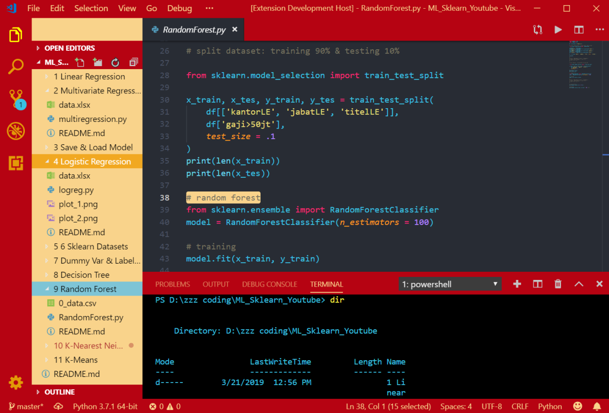

# Hello Nakama!

[Tokopedia](https://www.tokopedia.com/) is an online marketplace that allows individuals and business owners in Indonesia to open and maintain their stores for free. It was founded in 2009 by William Tanuwijaya & Leontinus Alpha Edison. As of November 2018, the company is valued at about $7 billion. Tokopedia describes its mission as democratizing commerce through technology.
- Download theme: [VScode Tokopedia Theme](https://marketplace.visualstudio.com/items?itemName=lintangwisesa.tokopedia).
- Source code: [VScode Tokopedia Theme Source Code](https://github.com/LintangWisesa/VScode-Tokopedia-Theme).

## Preview 🔍

#

#### Lintang Wisesa 💌 _lintangwisesa@ymail.com_

[Facebook](https://www.facebook.com/lintangbagus) | 
[Twitter](https://twitter.com/Lintang_Wisesa) |
[Google+](https://plus.google.com/u/0/+LintangWisesa1) |
[Youtube](https://www.youtube.com/user/lintangbagus) | [GitHub](https://github.com/LintangWisesa) |
[Hackster](https://www.hackster.io/lintangwisesa)